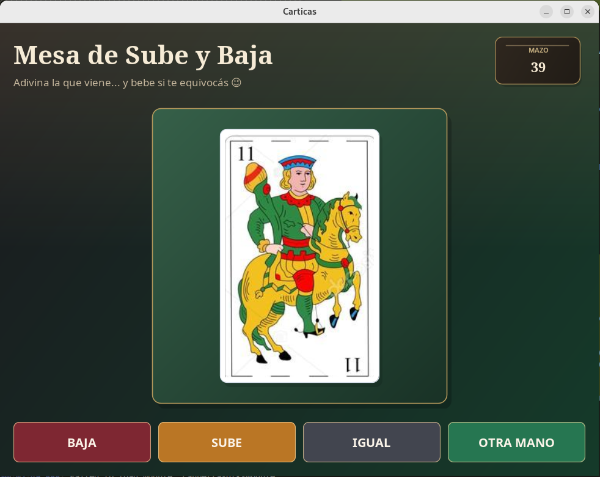

# Sube y Baja



Sube y Baja es un tradicional juego de tragos en Venezuela, aqui llevado a una app de escritorio en Java Swing.

Autor: David Marquez (djmbdv)


La idea es sencilla: ves una carta, apuestas si la siguiente va a ser mas alta, mas baja o igual, y el resultado decide quien toma.

## Como se juega

1. El juego muestra una carta del mazo.
2. El jugador elige una opcion: `BAJA`, `SUBE` o `IGUAL`.
3. Se revela la siguiente carta.
4. Si aciertas, te salvas.
5. Si fallas, la app indica cuantos tragos tocan.
6. Si sale igual cuando no lo esperabas, o pegas un `IGUAL`, la ronda se resuelve con penalizacion o premio doble.

## Controles

- `BAJA`: apuestas a que la siguiente carta es menor.
- `SUBE`: apuestas a que la siguiente carta es mayor.
- `IGUAL`: apuestas a que la siguiente carta tiene el mismo valor.
- `OTRA MANO`: reinicia la partida con un mazo nuevo.

## Requisitos

- Java instalado.
- `javac` y `java` disponibles en el sistema.

## Ejecutar

```bash
bash build.sh
```

El script compila `Main.java` y luego abre la app.

## Archivos principales

- `Main.java`: logica del juego y UI en Swing.
- `build.sh`: compilacion y arranque seguro en Linux.
- `app.png`: captura de la interfaz.
- `oro.jpg`, `copas.jpg`, `espada.jpg`, `basto.jpg`: sprites de las cartas.

## Detalles de la app

- Interfaz estilo mesa de cartas.
- Animacion al revelar la siguiente carta.
- Feedback visual cuando toca beber.
- Reinicio rapido de la partida.

## Nota sobre Linux/Snap

Si ves este error:

```text
java: symbol lookup error: /snap/core20/current/lib/x86_64-linux-gnu/libpthread.so.0: undefined symbol: __libc_pthread_init, version GLIBC_PRIVATE
```

usa el script `build.sh`, que ya limpia variables conflictivas (`LD_LIBRARY_PATH`, `LD_PRELOAD`, etc.) antes de arrancar Java.

## Licencia

Este proyecto esta publicado bajo la licencia MIT. Eso obliga a conservar el aviso de copyright y la licencia en las copias del software.

Consulta el archivo [LICENSE](LICENSE) para el texto completo.
